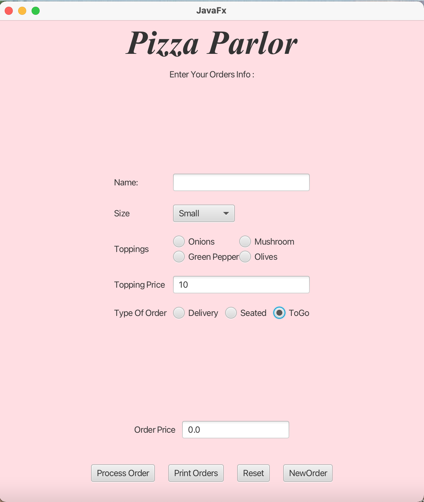

# Pizza Parlor Order Management System  

The **Pizza Parlor Order Management System** is a **JavaFX-based application** designed to efficiently handle **pizza orders** based on customer preferences. The system supports different order types, including **Seated , To-Go , and Delivery**. Orders are stored,and printed to a file for record-keeping.  

The project follows an **object-oriented approach** with a structured class hierarchy for handling different order types.  

---

## Features 

✔ **Place a New Order** – Customers can place an order by selecting pizza type, size, toppings, and order type.  
✔ **Order Types:**  
   - **Seated** – Assigns a table for dine-in customers.  
   - **To-Go** – Customers can pick up their order at a specified time.  
   - **Delivery** – Orders are sent to the customer's address with an assigned delivery person.

✔ **View All Orders** – Displays a list of all active and completed orders.  
✔ **Print Orders to File** – Saves all orders to a file for record-keeping.  

## Main Classes  

- **`PizzaOrder`** (Base Class) – Contains general attributes for an order.  
- **`Seated`** (Subclass) – Handles dine-in orders and manages table assignments.  
- **`ToGo`** (Subclass) – Manages takeout orders with pickup scheduling.  
- **`Delivery`** (Subclass) – Manages home delivery, including delivery charges and tracking.  
- **`Driver`** – JavaFX class that provides the graphical user interface for order management.  

## Example Usage

To run the program, Run the Driver.java file :

## Contact

For any inquiries, reach out via:

- Email: [miar.taweel04@gmail.com](mailto\:miar.taweel04@gmail.com)
- GitHub: [miarTaweel](https://github.com/miarTaweel)
